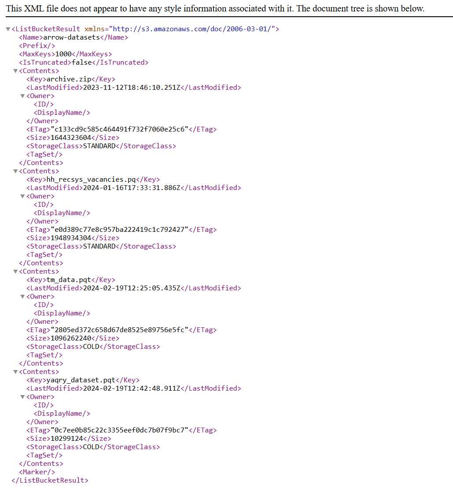
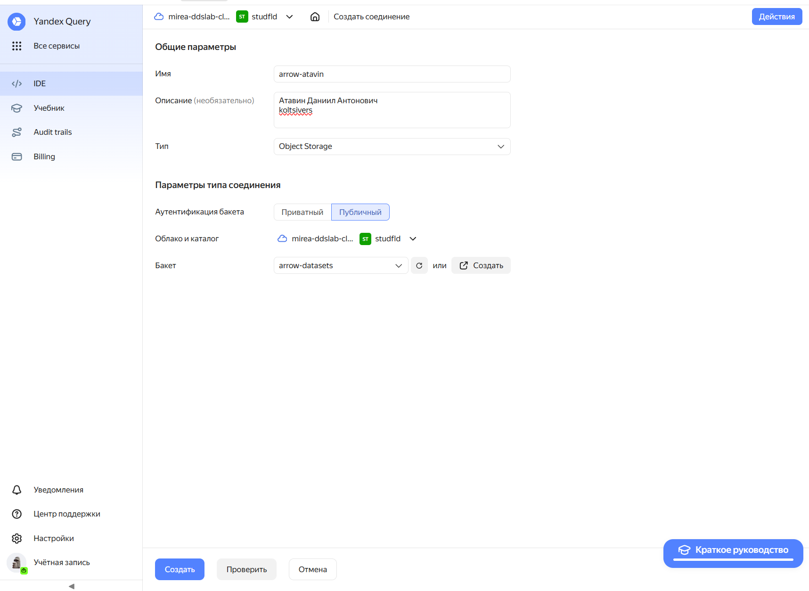
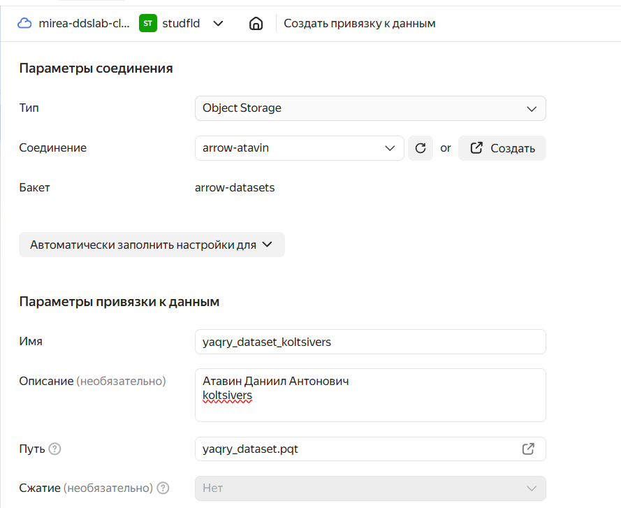
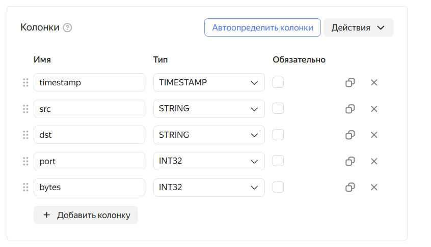
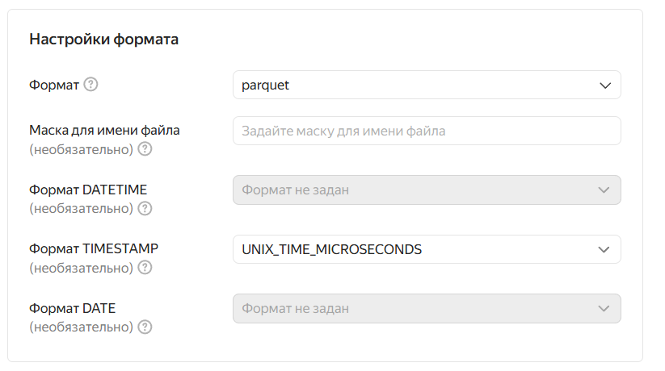
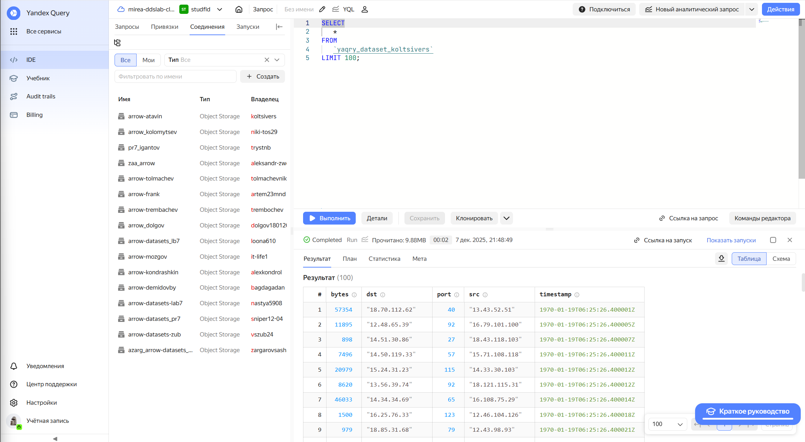
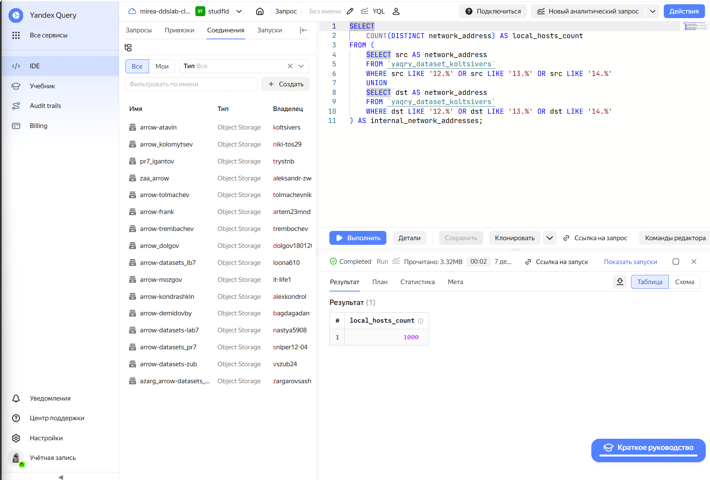
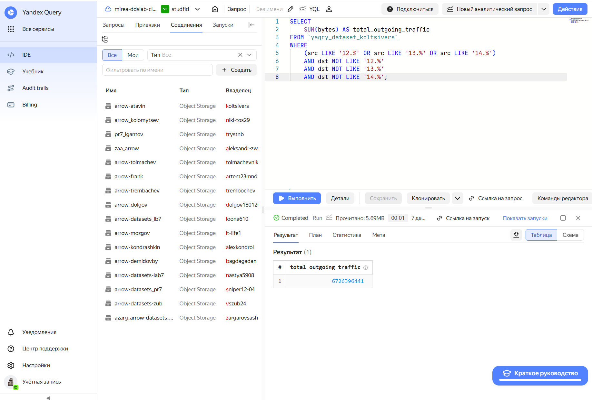
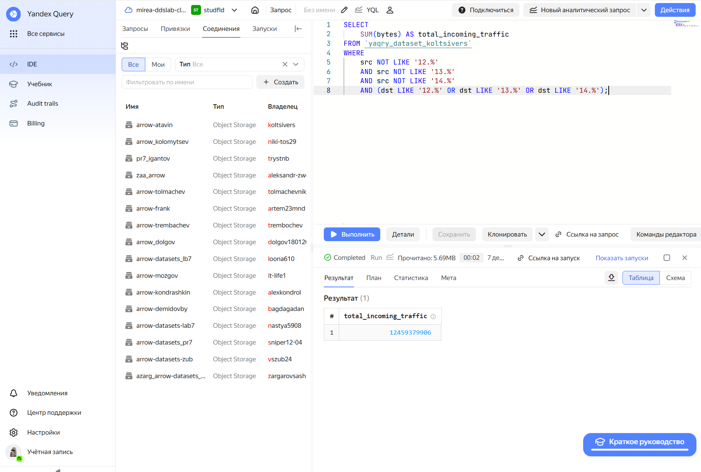

# Практическая работа №7
koltsivers@yandex.ru

## Цель работы

1.  Изучить возможности технологии Yandex Query для анализа
    структурированных наборов данных
2.  Получить навыки построения аналитического пайплайна для
    анализаданных с помощью сервисов Yandex Cloud
3.  Закрепить практические навыки использования SQL для анализа данных
    сетевой активности в сегментированной корпоративной сети

## Исходные данные

1.  Программное обеспечение ОС Windows 11 Pro
2.  RStudio
3.  Интерпретатор языка R 4.5.2

## Задание

Используя сервис Yandex Query настроить доступ к данным, хранящимся в
сервисе хранения данных Yandex Object Storage. При помощи
соответствующих SQL запросов ответить на вопросы

## План

1.  Проверить доступность данных в Yandex Object Storage.
2.  Подключить бакет как источник данных для Yandex Query.
3.  Произвести анализ данных: 3.1 Известно, что IP адреса внутренней
    сети начинаются с октетов, принадлежащих интервалу \[12-14\].
    Определите количество хостов внутренней сети, представленных в
    датасете. 3.2 Определите суммарный объем исходящего трафика. 3.3
    Определите суммарный объем входящего трафика.

## Шаги:

### Шаг 1

#### Проверим доступность данных в Yandex Object Storage

Перейдем по ссылке https://storage.yandexcloud.net/arrow-datasets и
проверим существование файла yaqry_dataset.pqt

### Шаг 2

#### Подключим бакет как источник данных для Yandex Query

Создадим соединение для бакета в S3 хранилище.

Настроим параметры соединения привязки к данным.

Настроим колонки в таблице.

Далее изменим формат для TIMESTAMP на основе заданных колонок.

Теперь проверим, что запросы выполняются.

### Шаг 3

#### Произведем анализ данных

Известно, что IP адреса внутренней сети начинаются с октетов,
принадлежащих интервалу \[12-14\]. Определите количество хостов
внутренней сети, представленных в датасете.

Определите суммарный объем исходящего трафика.

Определите суммарный объем входящего трафика.

## Оценка результата

В рамках данной практической работы было исследовано использование
технологии Yandex Query для анализа данных сетевой активности.

## Вывод

В ходе практической работы мы познакомились с сервисами Yandex Cloud,
изучили возможности технологии Yandex Query для анализа
структурированных наборов данных, а также что такое S3 хранилище и как
им пользоваться.

